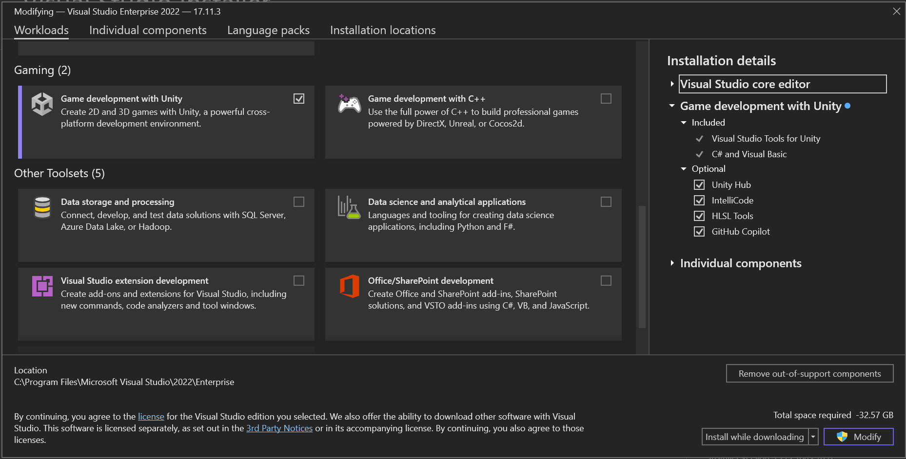
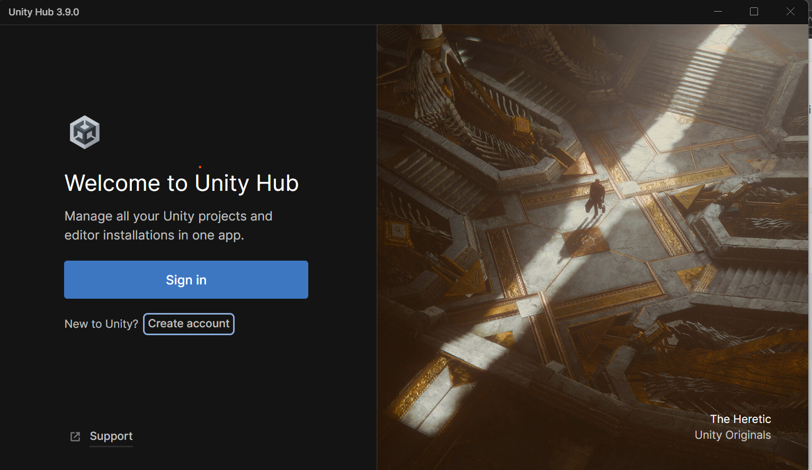
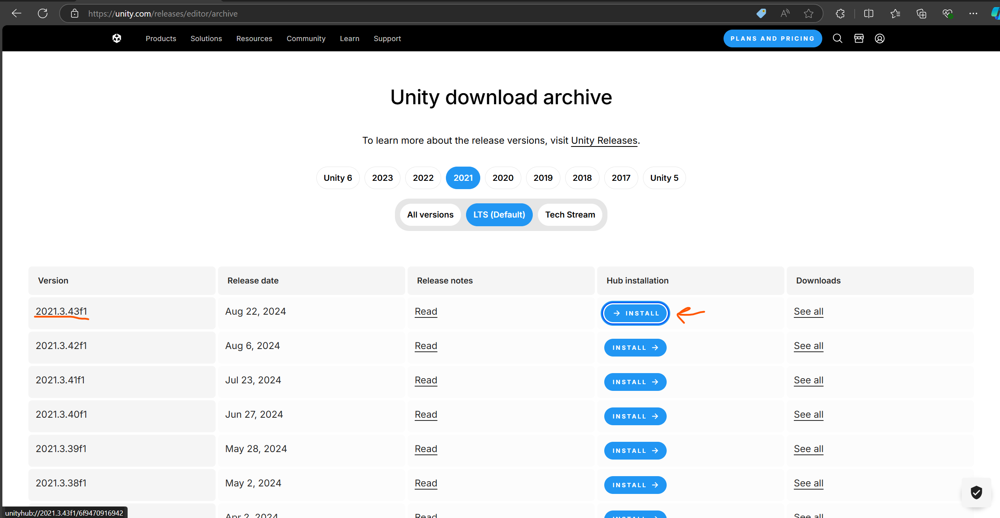
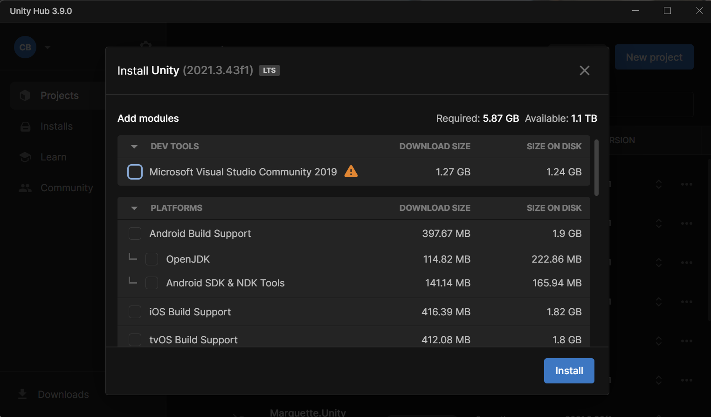
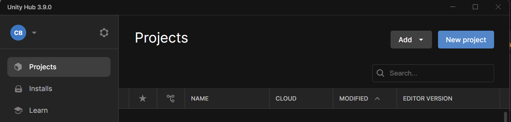
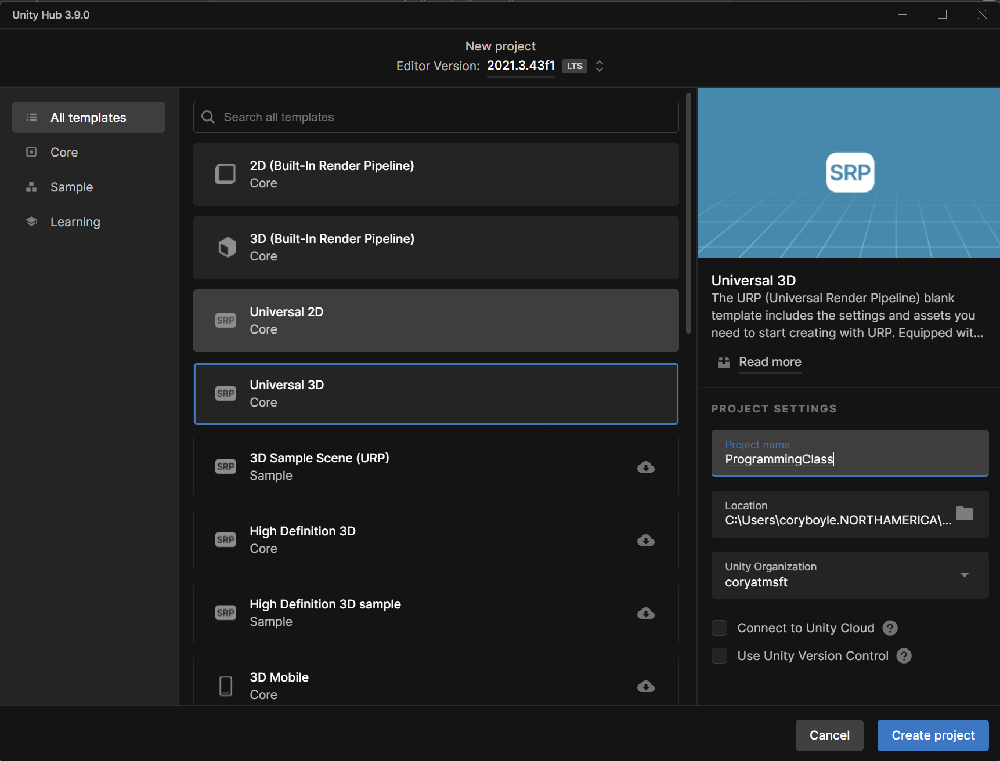

# Game Programming Class
A collection of weekly game programming prompts along with samples to teach programming concepts.

# Game Engines
A game engine is the collection of code and tools use to create and run games. For this class, we will be using either Make Code Arcade or Unity3d depending on the student's device capabilties and challenge level.
## Make Code Arcade
[Make Code Arcade](https://arcade.makecode.com/) is a simple block-style coding interface that allows students with any device to program simple games.

> Pros:
> - No installation required
> - Runs on most web-capable devices. Phones and tablets included!
> - Drag and drop "block" coding
> - Easily shareable projects
> 
> Cons:
> - Extremely limited graphics
> - Only supports relatively simple game projects
> - Javascript and Python experience isn't the best.

### Installation
No installation required! Open the website at [https://arcade.makecode.com/](https://arcade.makecode.com/) and click new project to get started.
## Unity3d
Unity3d is an industry-standard game engine that allows projects to be coded once and deployed to nearly any game platform including Windows, Xbox, PLaystation, Switch, Web, and more. Unity3d requires a computer with dedicated graphics memory to run well.

> **Pros**:
> - Industry standard game engine
> - Capable of multiple game and graphics styles
> - Has options for visual node programming as well as C# programming language
> - Students can actually publish a game they make through Unity.
> 
> **Cons**:
> - Requires a computer (PC or Mac) with dedicated graphics memory
> - Requires installation and setup. You will also need to create a free Unity account.
> - More capabilities means more complexity
> - Can be difficult to share projects

### Installation

1. Download and install Visual Studio Community 2022. When it asks for what features you want to add, scroll down and check the `Game development with Unity` box.

2. Check to see if Visual Studio installed Unity Hub. If not, download and install the Unity Hub from [Unity's website](https://unity.com/download). Open the Unity Hub.
3. Ask a responsible adult in your life to help you create a free Unity ID account by clicking `Create account`. Then sign in with your Unity ID.
 
4. Install Unity version 2021.3.43f1 from the [Unity archive site](https://unity.com/releases/editor/archive).

5. When asked, uncheck all the boxes click Install. Wait for the install to finish.

6. Still in Unity Hub, select the Projects section on the left and then click `New Project`.

7. Download the `Universal 3D` project template. Give your project a name and choose a location on your device to create the project in. Uncheck the boxes Then click `Create project`.

8. Optionally, you can import the lab examples from the latest lab class Unity Package file. See the Band or Discord for the latest.